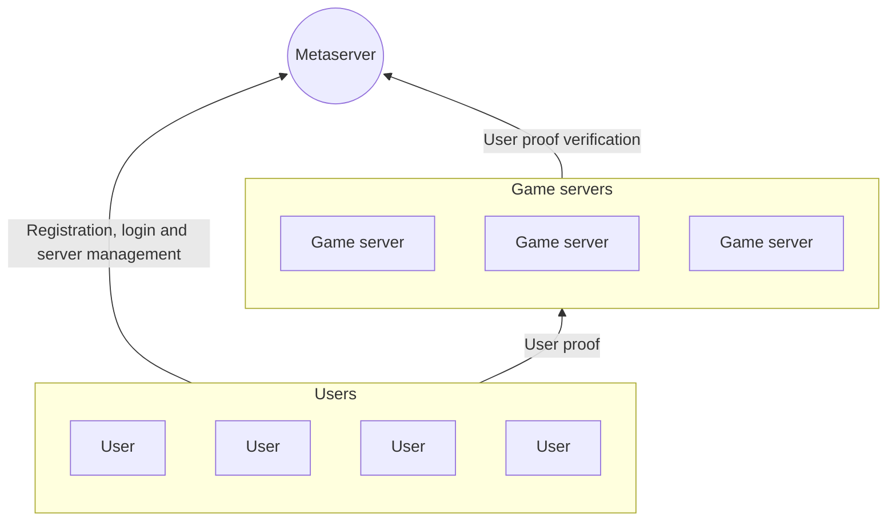
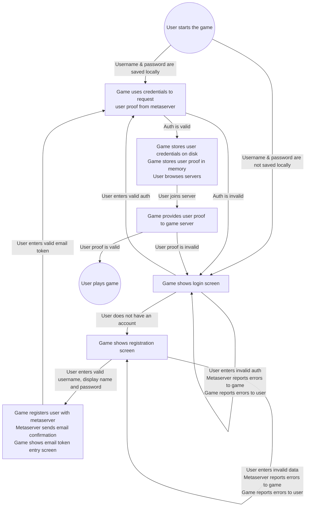

# Metaserver

[](https://github.com/stfwn/savage-metaserver/actions/workflows/test.yml)
[](https://github.com/stfwn/savage-metaserver/actions/workflows/black.yml)

The Metaserver organizes the many-to-many relationship between users and game
servers. It enables a single account to work across all game servers, in a
cryptographically secure way. The only thing users share with game servers is
proof that they are registered and verified with the metaserver. Similarly,
users can trust that the game servers listed by the metaserver are
administrated by users that are registered and verified with the metaserver.



## Installation

Install the dependencies in a virtual env:

1. Prepare the env: `python -m venv env`
2. Activate it for you current shell session: `source env/bin/activate`
3. Install modules: `pip install -r requirements.txt`


## Development

1. Activate the virtual env (`source env/bin/activate`)
2. Set `export DEV=true` for verbose SQL logs.
3. Optionally set your `DATABASE_URL` environment variable to the back-end of
   your choosing. Otherwise (and during tests) it's in-memory SQLite.
4. Write tests using the test client in `tests/` and run them with `pytest`. No
   need for throwaway cURL stuff and we end up with some tests too!
5. Implement things in `metaserver/`.
6. GOTO 4.

### Migrations

Autogenerating migrations:

```bash
alembic revision --autogenerate -m "My migration message"
```

Applying migrations:

```bash
alembic upgrade head
```

## Deployment

1. Clone the repository.
2. Configure the environment variables:

   ```bash
    AWS_ACCESS_KEY_ID=...
    AWS_SECRET_ACCESS_KEY=...
    AWS_DEFAULT_REGION=eu-central-1
    DATABASE_URL="sqlite:///metaserver.db"
   ```
3. Run with `docker compose up --build --detach`

## FAQ

### What is the user registeration/login/user proof token flow?



### What is the server registeration/update/browser flow?

- User wants to start a new server.
    1. POST to `/v1/server/register`.
        - Authenticate with user auth info
        - Post the info of the server that is to be registered (see `/docs` for
          the schema)
    2. Receive a server `username` (integer, not secret) and a server
       `password` (string, secret). Store this auth info.
- A user wants to see which servers are online. *Note: 'online' is defined as
  having had their info updated in the last X seconds show up.*
    1. GET `/v1/server/online`.
        - Authenticate with user auth info.
- A user wants to see which servers they have registered.
    1. GET `/v1/server/my`.
        - Authenticate with user auth info.
- A user wants to update the information for their server.
    1. POST `/v1/server/update`.
        - Authenticate with the server auth info received on registration.
        - Pass the new server info as data. This refreshes the datetime on
          which the server was updated and ensures it is visible when users
          request a list of online servers.

### I can haz REST spec?

Yes. Follow the installation steps, run the server with `make serve` and visit
`127.0.0.1:8000/docs`. You can even get an `openapi.json` file from
`http://127.0.0.1:8000/openapi.json` and automatically generate a client from
it.

### How does the ranking system work?


It's my generalization of the [Elo rating
system](https://en.wikipedia.org/wiki/Elo_rating_system) for teams. Let the
rating of a given player $n$ be $R_n$, and let the mean rating of a team they
played on be $T_n$. Using a hyperparameter $\lambda$, we define the
team-weighted rating for player $n$:

$$R_n^w = \lambda T_{n} + (1-\lambda) R_{n}$$

If player $a$ and player $b$ played a match on opposing teams, the expected
score $E_a$ for player $a$ is:

$$E_a = \frac{Q_a}{Q_a + Q_b}$$

With $Q_n = 10^{R^w_n \over S}$, where $S$ is the starting rating for new
players. Finally, if player $n$'s team won, the new rating for this player is
computed:

$$R'_n = R_n + \frac{S \alpha}{R_n} (A_n - E_n)$$

Here $\alpha > 0$ is a hyperparameter that sets the update step size, and $A_n$
is the achieved score for player $n$, which is $1$ in case of a win, $0.5$ in
case of a draw, and $0$ in case of a loss.

Some nice properties compared to vanilla Elo:

- The expected score is adjusted based on both the player's own rating, as well
  as the team's rating. The balance can be adjusted to place more importance on
  the team's rating $(\lambda \rightarrow 1)$, or the individual's contribution
  $(\lambda \rightarrow 0)$.
- It's harder for players at the top end to gain/lose rating than it is at the
  bottom. This achieves two goals:
  - It limits rating inflation over time.
  - It limits incentives to be risk-averse for players with a high rating.
